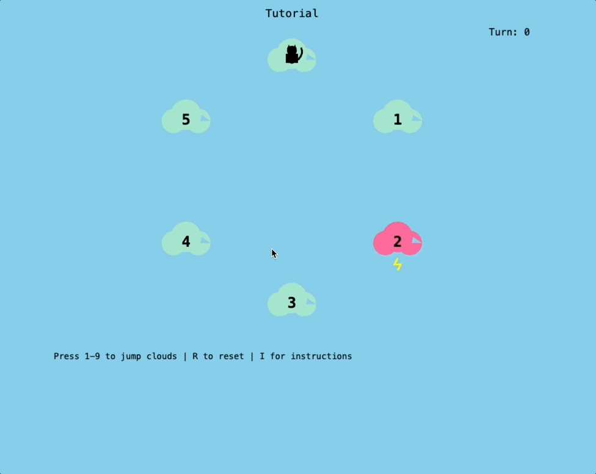

# 🐱 Cat Hop Cloud

> Help a lost black cat use its luck energy to hop back home through the clouds!

## 🎮 Play Now!

**[Play Cat Hop Cloud](https://helmedeiros.github.io/cat_hop_cloud/)** - Available on GitHub Pages



## 🌤️ About the Game

Your black cat is lost in the clouds and needs to use its precious **luck energy** to hop back home to cloud 0. But beware - not all clouds are friendly!

### Cloud Types

- 🟢 **Safe Clouds** - Normal clouds, safe to land on
- 🔴 **Thunder Clouds** - Zap! Lose 2 extra luck points
- 🔵 **Wind Clouds** - Whoosh! Your next jump gets +1 distance
- 🟡 **Lucky Clouds** - Fortune! Gain 5 luck points
- 🟣 **Checkpoint Clouds** - Must visit all before going home
- 🟠 **One-Way Clouds** - Forces your next jump to be exactly 2 clouds

### 🎯 How to Play

1. **Start**: Your cat begins on cloud 0 with 100 luck points
2. **Jump**: Press number keys (1-9) to jump that many clouds forward
3. **Energy Cost**: Each jump costs luck equal to the distance
4. **Goal**: Visit all checkpoints (!) then return to cloud 0 with luck remaining!

### 🎮 Controls

- **1-9**: Jump 1-9 clouds forward
- **R**: Reset the current level
- **I**: Toggle instructions menu

## 💡 Gameplay Tips

- Plan your route carefully - every jump counts!
- Thunder clouds (red) cost 2 extra luck when you land on them
- Wind clouds (blue) give your next jump +1 distance for free
- Lucky clouds (yellow) are worth the detour for +5 luck
- After turn 5, each turn costs 1 extra luck - be quick!
- One-way clouds (orange) force your next jump to be exactly 2

## 🎯 Version 2.0 - Strategic Puzzle Mode

The game now features 10 carefully designed levels that progressively introduce new mechanics:
- **Tutorial levels** to learn the basics
- **Checkpoint challenges** requiring strategic routing
- **Wind puzzles** using boost mechanics
- **One-way mazes** with forced movements
- **Master levels** combining all mechanics

Track your best scores and unlock new levels as you progress!

## 🚀 Deploy Your Own

Want to host your own version? The game is self-contained in a single HTML file!

### GitHub Pages Deployment

1. Fork this repository
2. Go to Settings → Pages
3. Select "Deploy from a branch"
4. Choose `main` branch and `/` (root) folder
5. Click Save
6. Your game will be live at `https://[your-username].github.io/cat_hop_cloud/`

### Local Development

```bash
# Clone the repository
git clone https://github.com/helmedeiros/cat_hop_cloud.git

# Open the game
open index.html

# Build for js13kGames submission
./build.sh
```

## 🛠️ Technical Details

### Algorithm
The game is based on a circular path-finding problem where you must minimize energy usage while avoiding hazards. The optimal solution involves dynamic programming to find the most efficient path.

### Size Optimization
- Minified variable names
- Inline styles and scripts
- No external dependencies
- Simple geometric shapes instead of images
- Final size: ~1.3KB zipped (well under 13KB limit)

## 🏆 js13kGames Compliance

✓ Single index.html file that runs directly in browser  
✓ No external resources or libraries  
✓ Total size under 13,312 bytes when zipped  
✓ Full source code available on GitHub  

## 📜 License

MIT License - Created for js13kGames competition 2024